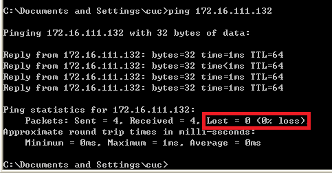
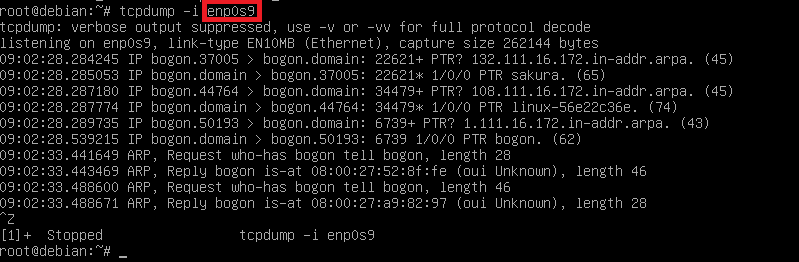
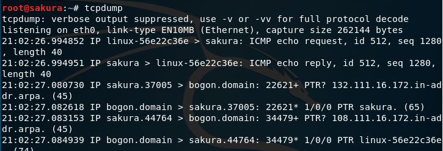
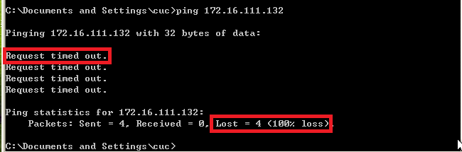
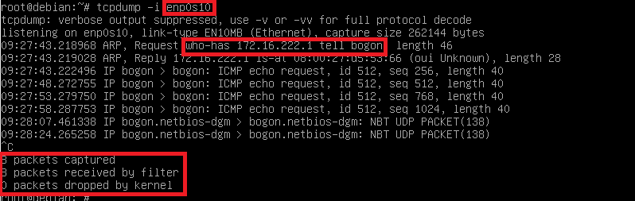
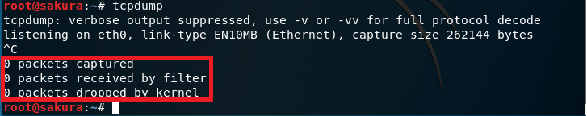

# chpt:0x01 基于 VirtualBox 的网络攻防基础环境搭建

## 实验目的

* 掌握 VirtualBox 虚拟机的安装与使用；

* 掌握 VirtualBox 的虚拟网络类型和按需配置；

* 掌握 VirtualBox 的虚拟硬盘多重加载；

## 实验环境

以下是本次实验需要使用的网络节点说明和主要软件举例：

* VirtualBox 虚拟机

* 攻击者主机（Attacker）：Kali Rolling 2109.2

* 网关（Gateway, GW）：Debian Buster

* 靶机（Victim）：From Sqli to shell / xp-sp3 / Kali

## 实验要求

* 虚拟硬盘配置成多重加载；

* 搭建要求的虚拟机网络拓扑；

* 完成以下网络连通性测试：
  * 靶机可以直接访问攻击者主机  
  * 攻击者主机无法直接访问靶机
  * 网关可以直接访问攻击者主机和靶机
  * 靶机的所有对外上下行流量必须经过网关
  * 所有节点均可以访问互联网

## 实验过程及结果记录

### 虚拟硬盘配置成多重加载

  

VB菜单栏->管理->虚拟介质管理->选中需修改为多重加载的虚拟硬盘，在下方的属性中将类型修改为多重加载。

结果示例：  
  

### 搭建网络拓扑

  
由图中的网络拓扑结构，可知共6台虚拟机，其中作为网关的虚拟机需能够连接内部网络internet-1、内部网络internet-2和NAT Natnetwork，至少需三块网卡，四台victim虚拟机只需能够连接各自所在的内部网络即可，Attacker需能够连接NAT Natnetwork。

**网卡的设置:** 当前虚拟机的设置->网络

* 若在修改网络连接方式时NAT网络的界面名称显示未指定，需在全局设定->网络中添加NAT网络名称，完成后再修改为NAT即可成功。

**使用下载的vdi文件安装虚拟机:** 需将下载的vdi文件在VB菜单栏->虚拟介质管理->注册

* 即将已有的vdi文件加入至虚拟机的虚拟硬盘目录中。然后再进行虚拟机创建，在创建时选择对应的现有虚拟硬盘即可。

### 实验操作

**先来记录一下本次实验中使用的各个虚拟机的ip信息：**

* Kali-Attacker:框出的即为NAT网卡代号和对应IP地址
  

* Debian-Gateway:红框：NAT网卡代号及IP地址；蓝框：内部网络1（internet-1）网卡代号及IP地址
  

* Kali-Victim-1:内部网络1（internet-1）网卡代号及IP地址  
  

**网卡配置情况：**

* Kali-Attacker的网卡配置情况：  
  

* Debian-Gateway的网卡配置情况：  
  

* Kali-Victim-1的网卡配置情况：  
  

* XP-Victim-1的网卡配置情况：  
  

**靶机（kali)ping攻击者：（仅截取了部分)**  
  
与此同时令网关监听自身的内部网络1网卡：  
  
及令攻击者主机监听自身的NAT网络网卡：  
  
执行相反操作，令攻击者主机ping靶机：  
不通：  
  
同时，又令靶机监听自身的内部网络1网卡：  
  

**网关ping靶机（kali)：**  
  
同时，令靶机监听自身的内部网络网卡（截图仅显示了部分结果）：  
  

**网关ping攻击者主机：**  
  
同时，令攻击者监听自身的NAT网络网卡（截图仅显示了部分结果）：  
  

**靶机（XP,internet1）ping靶机（kali,internet1):**  
  
同时令网关监听内网1网络网卡：  
  
以及kali对自身内网1网络网卡的监听：  

**靶机（XP,internet2）ping靶机（kali,internet1):**  
  
同时令网关对内网2网络网卡进行监听：  
  
及令接收方kali进行监听：  
  

**攻击者访问互联网：**  
  
**靶机访问互联网：**  
  
  
  

**网关访问互联网：**  
  

## 实验总结

* **靶机可以直接访问攻击者主机：**  
由之前的网络配置：靶机采用Internal内部网络的网络连接方式，攻击者采用NAT网络地址转换的网络连接方式。内网模式下的靶机只能与同属于一个内部网络的虚拟机相互通信，不能与主机或其他网络下的虚拟机进行通信；而NAT网络下的攻击者只能与同属于该网络的网关debian相互通信，对相对而言属于外网的靶机是不可访问的。作为网关的虚拟机既拥有Internal内部网络的网卡，又拥有NAT网络网卡，故靶机可以经由网关访问攻击者，故在实验操作的靶机ping攻击者主机的过程中，分别对网关、攻击者方进行监听，均监听到有数据流动，这也说明了靶机和攻击者在网络层的连通性。
* **攻击者主机无法直接访问靶机：**  
由前所述，攻击者使用NAT网络连接方式而靶机使用内网模式，故攻击者在向外访问时需经过自身的默认路由，通过网络地址转换，映射成宿主机IP,然后通过宿主机路由，最后通过宿主机上的网卡发送出去，即NAT网络模式会使得通信结果变成宿主机与靶机的通信，而由于靶机使用内网模式，是与宿主机完全断开的，因此攻击者反向ping靶机时，再次对网关、靶机方进行监听，均无回应。这也是NAT网络和内部网络特点的体现。
* **网关可以直接访问攻击者主机和靶机：**  
网关虚拟机拥有NAT网络网卡和连接内部网络1的网卡，所以网关可以与双方通信。网关分别ping攻击者和靶机，再对二者（作为接收方）分别监听，均有回应。说明彼此在网络层连通。
* **靶机的所有对外上下行流量必须经过网关：**  
由前所述，靶机使用内部网络连接模式，故与外部网络的主机通信时必定会经过外网的网关与靶机所在内部网络的网关以完成数据包转发。使另一靶机XPping靶机kali，执行同样操作，在网关和kali处均收到回复。证明了网关的传输连接作用。在实践中使用的是同一内网1（internet1）中的XP来ping靶机kali，此时由于在同一内网，所以监听有回复。而在尝试中也使用了内网2（internet2)中的XP来ping靶机kali，此时则失败，这也体现了内部网络的仅内网中可连通的特点。  
此处指向查阅的网站->[please click me](https://blog.csdn.net/ning521513/article/details/78441392)
* **所有节点均可以访问互联网：**  
网络拓扑中所有节点使用的网络连接模式均允许与互联网的通信，NAT模式下的攻击者可以访问到主机能访问到的所有网络，而内网模式的靶机也可通过网关完成通信。实验操作中，分别令靶机kali、靶机XP、攻击者和网关执行ping baidu.com和ping 8.8.8.8两个操作，均收到回复，也排除了域名服务器设置出错的问题。

## 出现的问题及解决

**1.虚拟机安装的虚拟硬盘多重加载失败**  
虚拟机安装完之后且建立了快照备份时，上述操作将失败，将报错称因当前的虚拟硬盘拥有不止一个子硬盘而修改失败，此时需将当前的所有备份快照删除然后再进行虚拟硬盘类型修改，将提示需释放该虚拟硬盘，释放后再在虚拟机的设置->存储->控制器->添加虚拟硬盘->选择现有的虚拟盘的虚拟硬盘列表中选中目标虚拟硬盘即可。

**2.DHCP设置**  
  
需要执行以下操作：  
  

**3.访问外部网络时的域名解析错误**  
  
将原有的nameserver更改为8.8.8.8后ping通，对于所有的linux虚拟机均执行了修改域名服务器的操作(上图中的vim一行执行后将进入编辑界面)，对XP虚拟机进行了关闭防火墙的操作以防被拦截。
