# chpt:0x01 基于 VirtualBox 的网络攻防基础环境搭建

## 实验目的

* 掌握 VirtualBox 虚拟机的安装与使用；

* 掌握 VirtualBox 的虚拟网络类型和按需配置；

* 掌握 VirtualBox 的虚拟硬盘多重加载；

## 实验环境

以下是本次实验需要使用的网络节点说明和主要软件举例：

* VirtualBox 虚拟机

* 攻击者主机（Attacker）：Kali Rolling 2109.2

* 网关（Gateway, GW）：Debian Buster

* 靶机（Victim）：From Sqli to shell / xp-sp3 / Kali

## 实验要求

* 虚拟硬盘配置成多重加载；

* 搭建要求的虚拟机网络拓扑；

* 完成以下网络连通性测试：
  * 靶机可以直接访问攻击者主机  
  * 攻击者主机无法直接访问靶机
  * 网关可以直接访问攻击者主机和靶机
  * 靶机的所有对外上下行流量必须经过网关
  * 所有节点均可以访问互联网

## 实验过程及结果记录

### 虚拟硬盘配置成多重加载

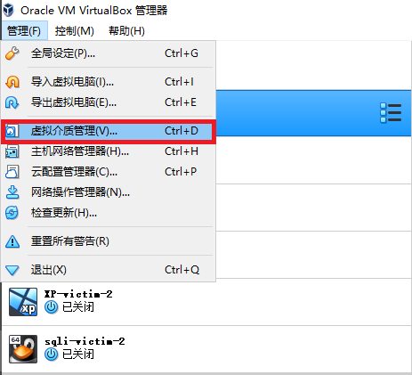    

VB菜单栏->管理->虚拟介质管理->选中需修改为多重加载的虚拟硬盘，在下方的属性中将类型修改为多重加载。

结果示例：
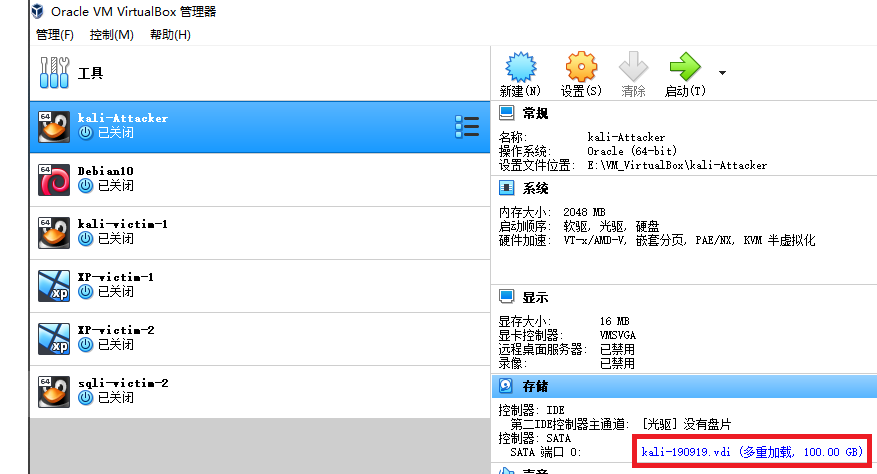    

### 搭建网络拓扑

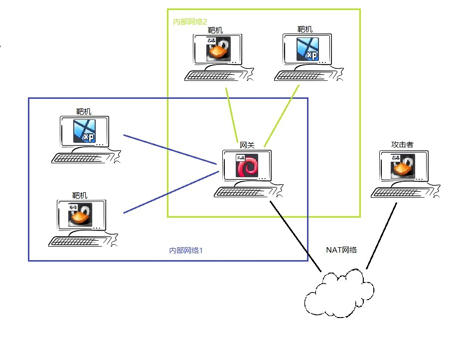    

由图中的网络拓扑结构，可知共6台虚拟机，其中作为网关的虚拟机需能够连接内部网络internet-1、内部网络internet-2和NAT Natnetwork，至少需三块网卡，四台victim虚拟机只需能够连接各自所在的内部网络即可，Attacker需能够连接NAT Natnetwork。

**网卡的设置:** 当前虚拟机的设置->网络

* 若在修改网络连接方式时NAT网络的界面名称显示未指定，需在全局设定->网络中添加NAT网络名称，完成后再修改为NAT即可成功。

**使用下载的vdi文件安装虚拟机:** 需将下载的vdi文件在VB菜单栏->虚拟介质管理->注册

* 即将已有的vdi文件加入至虚拟机的虚拟硬盘目录中。然后再进行虚拟机创建，在创建时选择对应的现有虚拟硬盘即可。

### 实验操作

**先来记录一下本次实验中使用的各个虚拟机的ip信息：**

* Kali-Attacker:框出的网络端口即为NAT端口和对应IP地址
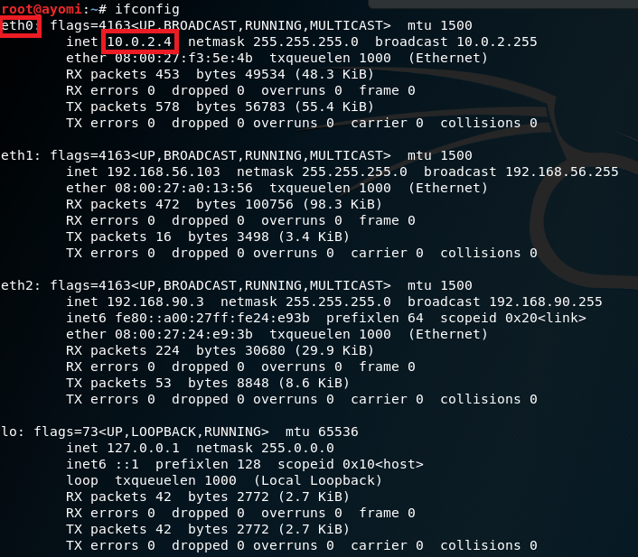    

* Debian-Gateway:红框：NAT网络端口名称及IP地址；蓝框：内部网络1（internet-1）端口名称及IP地址
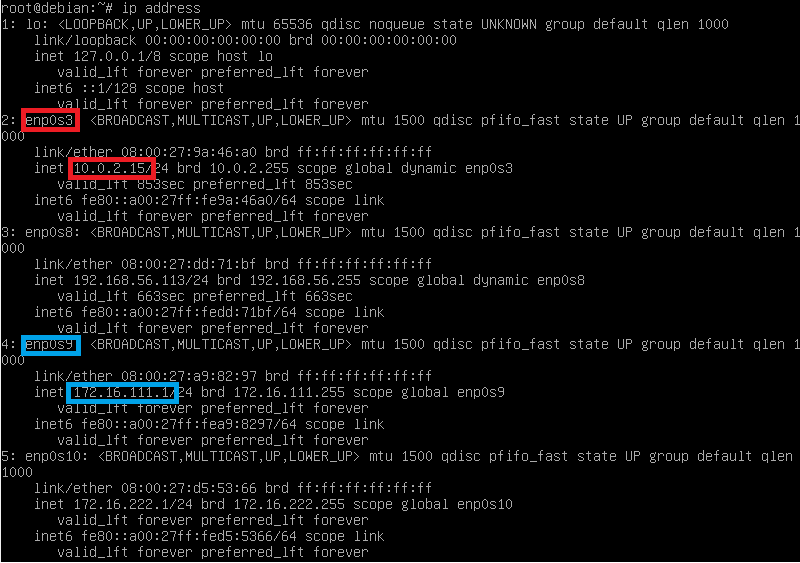    

* Kali-Victim-1:内部网络1（internet-1）端口名称及IP地址
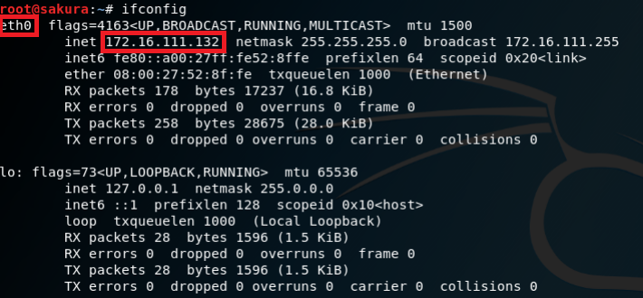    

**网卡配置情况：**

* Kali-Attacker的网卡配置情况：
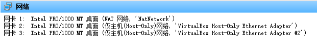    

* Debian-Gateway的网卡配置情况：
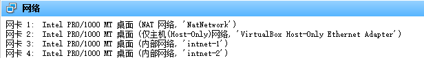     

* Kali-Victim-1的网卡配置情况：
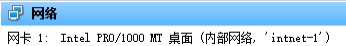    

* XP-Victim-1的网卡配置情况：
    

**靶机ping攻击者：（仅截取了部分)**
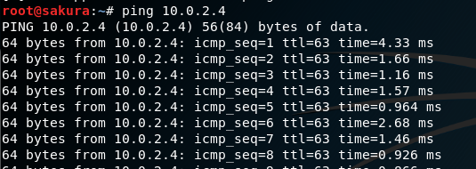     
与此同时令网关监听自身的内部网络1网络端口：
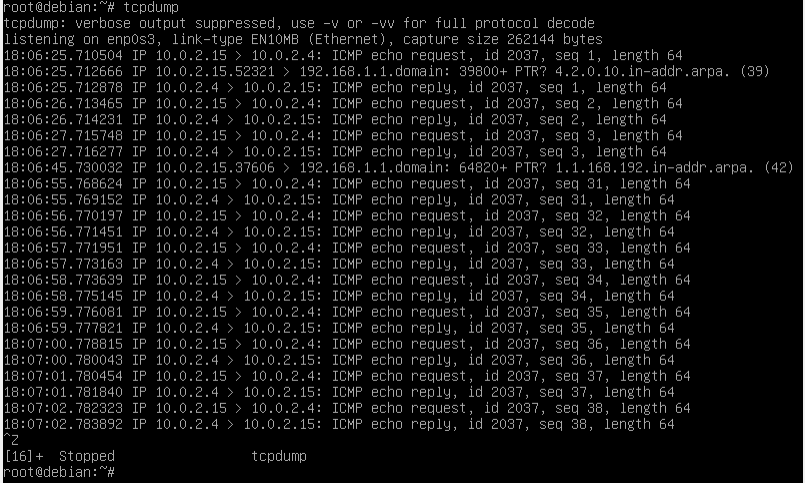      
及令攻击者主机监听自身的NAT网络端口：
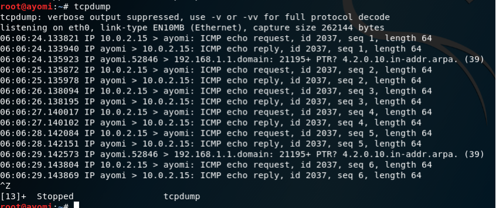    
执行相反操作，令攻击者主机ping靶机：   
不通：
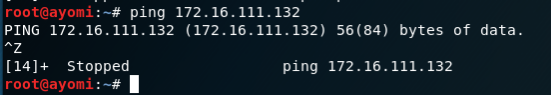    
同时，又令靶机监听自身的内部网络1端口：
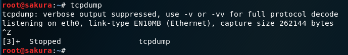    
也令网关监听自身的NAT网络端口：
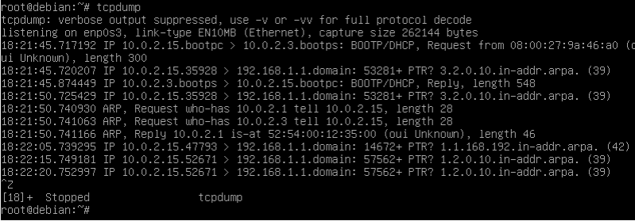    
*上网查阅得：NAT联网方式下，主机被虚拟为10.0.2.1，192.168.1.1为常见的路由器登陆IP地址。但10.0.2.3为未知，从tcpdump的抓包结果来看，网关虚拟机向路由器登陆地址发送了某些消息并广播询问了主机的MAC地址。（？？？）*

**网关ping靶机：**
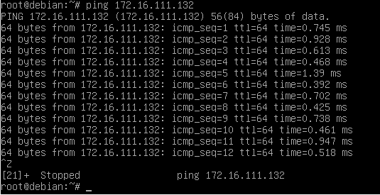    
同时，令靶机监听自身的内部网络端口（截图仅显示了部分结果）：
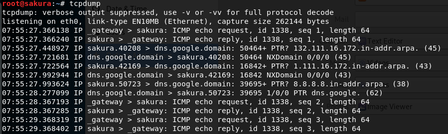    

**网关ping攻击者主机：**
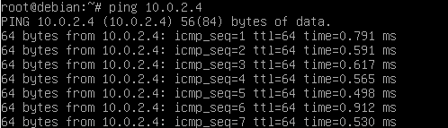    
同时，令攻击者监听自身的NAT网络端口（截图仅显示了部分结果）：
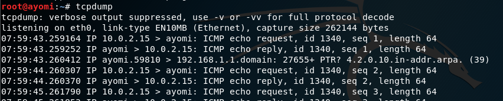    

**攻击者访问互联网：**
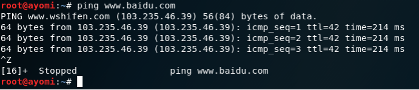    
**靶机访问互联网：**
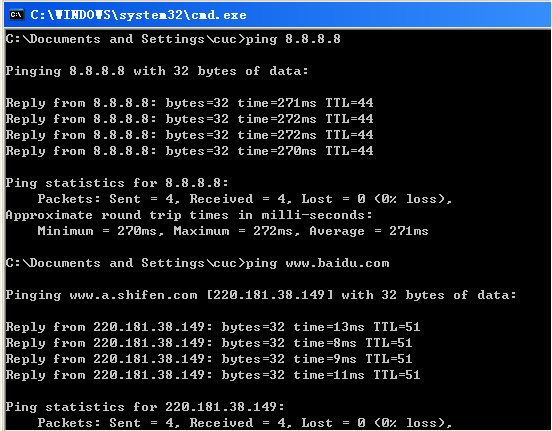    
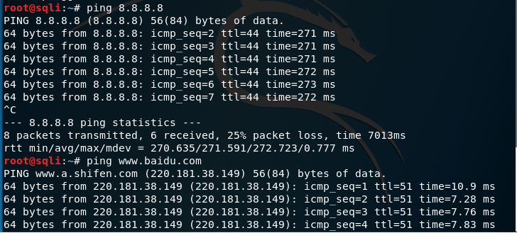    
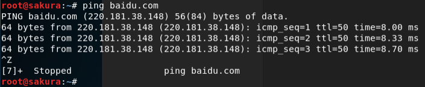    

**网关访问互联网：**
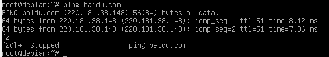    

## 出现的问题及解决

**1.虚拟机安装的虚拟硬盘多重加载失败**   
虚拟机安装完之后且建立了快照备份时，上述操作将失败，将报错称因当前的虚拟硬盘拥有不止一个子硬盘而修改失败，此时需将当前的所有备份快照删除然后再进行虚拟硬盘类型修改，将提示需释放该虚拟硬盘，释放后再在虚拟机的设置->存储->控制器->添加虚拟硬盘->选择现有的虚拟盘的虚拟硬盘列表中选中目标虚拟硬盘即可。

**2.DHCP设置**
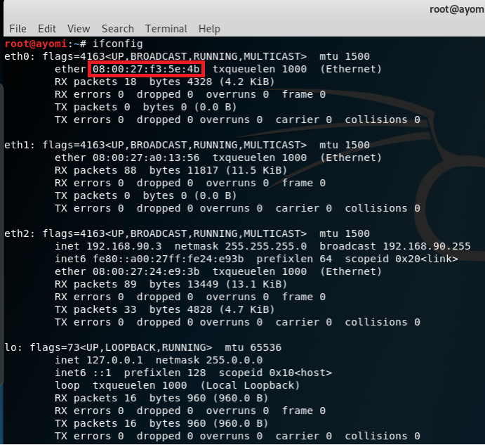    
需要执行以下操作：
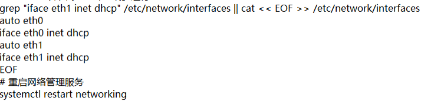    

**3.访问外部网络时的域名解析错误**
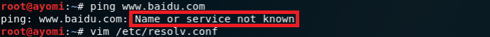    
将原有的nameserver更改为8.8.8.8后ping通，对于所有的linux虚拟机均执行了修改域名服务器的操作(上图中的vim一行执行后将进入编辑界面)，对XP虚拟机进行了关闭防火墙（但我在某次ping中并没有关闭也正常）的操作，另，内网中的靶机连接外网需同时打开网关虚拟机，否则即使修改网络连接设置中的IP和DNS也无用。
