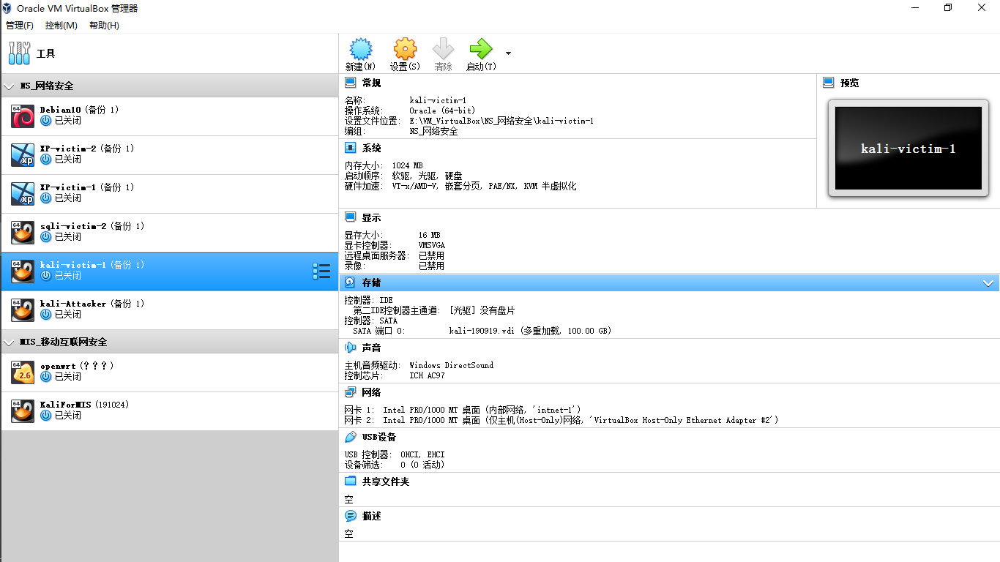
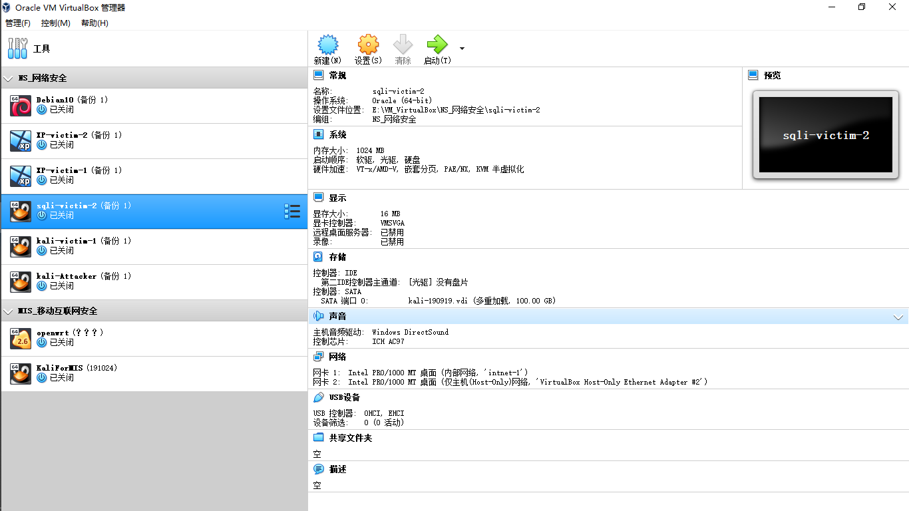
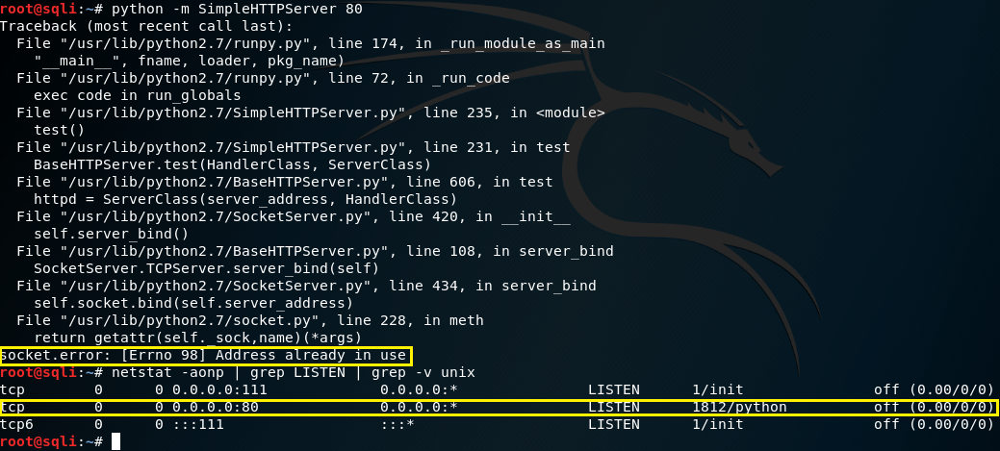
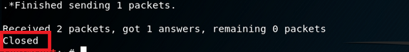
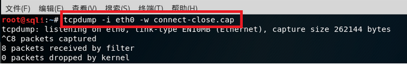

# 基于scapy编写扫描器
## 实验目的

* 掌握网络扫描之端口状态探测的基本原理

## 实验环境

* python + scapy

## 实验要求

* 禁止探测互联网上的 IP ，严格遵守网络安全相关法律法规
* 完成以下扫描技术的编程实现
  * TCP connect scan / TCP stealth scan
  * TCP Xmas scan / TCP fin scan / TCP null scan
  * UDP scan
* 上述每种扫描技术的实现测试均需要测试端口状态为：开放、关闭 和 过滤 状态时的程序执行结果
* 提供每一次扫描测试的抓包结果并分析与课本中的扫描方法原理是否相符？如果不同，试分析原因；
* 在实验报告中详细说明实验网络环境拓扑、被测试 IP 的端口状态是如何模拟的
* （可选）复刻 nmap 的上述扫描技术实现的命令行参数开关

## 实验过程

### 一、实验环境简介
 1. kali-victim-1的网络设置



2. sqli-victim-2的网络设置



3. 网关网络设置


### 二、实验过程

对于TCP连接来说，端口的状态有开启和关闭两种状态 可以用python自带的SimpleHTTPserver模块来开启TCP的80端口，运行命令```python -m SimpleHTTPServer 80```即可完成，下图中还使用```netstat -aonp | grep LISTEN | grep -v unix```命令查看了当前被使用的端口：  
  
可以看到此时80端口是关闭的。  
在sqli-victim-2中开始抓包后，kali-victim-1上用python运行写好的tcp连接扫描代码。  


用wireshark打开监听结果，可找到与开放的80端口建立连接时，两台主机间的三次交互过程  
1.172.16.111.120->172.16.111.132 [S] SYN  
2.172.16.111.132->172.16.111.120 [S.] SYN,ACK  
3.172.16.111.120->172.16.111.132 [R.] RST,ACK  
（与关闭的8080端口连接时，只有两次交互过程  
1.172.16.111.120->172.16.111.132 [S] SYN  
2.172.16.111.132->172.16.111.120 [R.] RST,ACK）  

---

端口关闭状态的测试中，查看处于开启状态的端口（同上），其中没有80端口，说明此时80端口处于关闭状态，在sqli中开始抓包后，在kali中运行tcp2.py文件,此时输出结果仍为closed。  

---

在tcp XMAX扫描的监听结果中，与开放的80端口建立连接时，只有扫描机给被扫描机的发包过程  
1.172.16.111.120->172.16.111.132 [FPU] PSH，FIN，URG  
然而与关闭的8080端口连接时，有两次交互过程  
1.172.16.111.120->172.16.111.132 [FPU] PSH、FIN和URG  
2.172.16.111.132->172.16.111.120 [R.] RST,ACK  

---

udp的扫描中,scapy的扫描结果显示53端口为open|filter状态，说明被扫描机没有发送任何响应包给扫描机，监听的结果与预想中一致  
只有172.16.111.120发送给172.16.111.132的UDP包，没有任何响应包  
对于关闭的67端口，可以观察到两台主机间有两次交互  
1.172.16.111.120->172.16.111.132 [|domain] UDP  
2.172.16.111.132->172.16.111.120 ICMP  

## 遇到的问题
kali中执行ifconfig时查看到的ip信息无ipv4地址，仅有ipv6地址。（此问题在实验1的报告中已经给出了解决方法，但是此时又遇到了就又再提出）